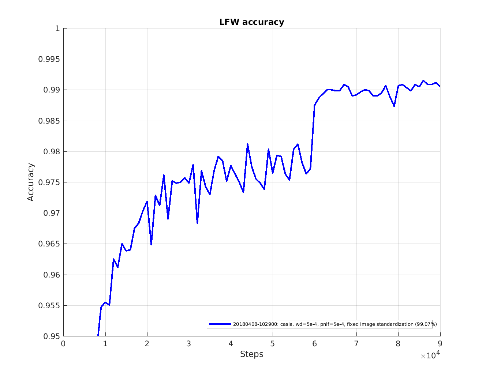

Trang nay mo ta cach dao tao mo hinh [Inception-Resnet-v1 model](https://arxiv.org/abs/1602.07261) voi tu cach la mot trinh phan loai, tuc la khong su dung triplet loss nhu duoc mo ta trong bai bao [Facenet](http://arxiv.org/abs/1503.03832). Nhu da neu trong [here](http://www.robots.ox.ac.uk/~vgg/publications/2015/Parkhi15/parkhi15.pdf), dao tao nhu mot trinh phan loai lam cho viec dao tao de dang hon va nhanh hon dang ke.
Bai bao ve FaceNet cung su dung phien ban khong phai Resnet cua kien truc Inception. Cac mang nay duong nhu kho dao tao hon, va khong hoi tu tot khi duoc dao tao tren bo du lieu CASIA / Facescrub. Vi du, dieu nay co the coi la mot gia tri loss kha lon tren tap huan luyen chua duoc chuan hoa, ngu y rang, mo hinh co the da overfit tren data. Su dung vi du Inception Resnet v1 giai quyet van de hoi tu va ket qua la hieu suat duoc cai thien dang ke tren tap du lieu LFW, ke ca ve do chinh xac va ty le ve do chinh xac tren tap du lieu xac nhan (VAL@FAR=10^-3).

## 1. Install Tensorflow
Phien ban hien tai cua trien khai nay yeu cau phien ban Tensorflow r1.7. No co the duoc cai dat bang cach su dung [pip](https://www.tensorflow.org/get_started/os_setup#pip_installation) hoac tu [sources](https://www.tensorflow.org/get_started/os_setup#installing_from_sources).<br>
Do viec dao tao cac mang than kinh sau can kha nang tinh toan manh, cho nen chung toi se su dung GPU voi su ho tro cua CUDA trong qua trinh dao tao. Trang cai dat cua Tensorflow cung co huong dan ve cach cai dat CUDA ho tro tinh toan tren GPU trong qua trinh dao tao mang.
## 2. Clone the FaceNet [repo](https://github.com/davidsandberg/facenet.git)
Dieu nay duoc thuc hien dua vao cau lenh: <br>
`git clone https://github.com/davidsandberg/facenet.git`

## 3. Set the python paths
Dat bien moi truong `PYTHONPATH` tro den thu muc  `src`  trong repo vua duoc clone ve cua ban. Dieu nay duoc thuc hien dua vao cau lenh <br>
`export PYTHONPATH=[...]/facenet/src`<br>
trong do `[...]` nen duoc thay the bang duong dan den thu muc chua repo vua clone ve cua ban.

## 4. Chuan bi tap du lieu dao tao
### Cau truc cua tap du lieu
Gia dinh rang, tap du lieu huan luyen duoc sap xep nhu ben duoi, tuc la trong do moi class se chua danh sach cac hinh anh thuoc class do

    Aaron_Eckhart
        Aaron_Eckhart_0001.jpg

    Aaron_Guiel
        Aaron_Guiel_0001.jpg

    Aaron_Patterson
        Aaron_Patterson_0001.jpg

    Aaron_Peirsol
        Aaron_Peirsol_0001.jpg
        Aaron_Peirsol_0002.jpg
        Aaron_Peirsol_0003.jpg
        Aaron_Peirsol_0004.jpg
        ...

### Face alignment
De can chinh khuon mat, chung toi su dung mo hinh [MTCNN](https://github.com/kpzhang93/MTCNN_face_detection_alignment) da duoc chung minh la dem lai hieu suat tot cho cong viec can chinh khuon mat tren bo du lieu train va test. Co rat nhieu trien khai tot cho MTCNN bang Matlab va Caffe ma ban co the tim thay tren github. Ngoai ra ban co the tim thay tap lenh matlab de can chinh bo du lieu khuon mat bang cach su dung trien khai sau day: [here](https://github.com/davidsandberg/facenet/blob/master/tmp/align_dataset.m).

De don gian hoa cho viec su dung trinh can chinh khuon mat duoc su dung trong du an nay, mot trien khai tensorflow/python MTCNN duoc cung cap tai day: [provided](https://github.com/davidsandberg/facenet/tree/master/src/align).  Viec trien khai nay khong co su phu thuoc vao bat ky cac yeu to nao khac ngoai tru tensorflow va thoi gian chay tren LFW tuong tu nhu viec thuc hien tren Matlab.

```
python src/align/align_dataset_mtcnn.py \
~/datasets/casia/CASIA-maxpy-clean/ \
~/datasets/casia/casia_maxpy_mtcnnpy_182 \
--image_size 182 \
--margin 44
```

Hinh anh dau ra duoc thu nho lai voi kich thuoc la 182 * 182. Dau vao cua mo hinh Inception Resnet v1 la 160 * 160 cung cap mot so margin de co the su dung random crop.

Doi voi cac thu nghiem da duoc thuc hien tren mo hinh Inception Resnet v1, mot margin bo sung duoc them vao la 32 pixel da duoc cong vao. Ly do cho viec bo sung nay la viec mo rong cac khung gioi han bbx se cung cap cho CNN mot so thong tin bo sung ngu canh. Tuy nhien viec cai dat cac tham so nay van chua duoc nghien cuu va rat co the la cac gia tri margin khac co the dan den hieu suat tot hon

De tang toc qua trinh can chinh, lenh tren co the thuc hien dua vao viec thuc hien song song nhieu tien trinh. Duoi day, cung mot lenh co the chay duoc song song tren 4 process/ De gioi han muc do su dung bo nho cua moi session Tensorflow, tham so `gpu_memory_fraction` se duoc dat thanh 0.25, dieu do co nghia la moi session co the duoc phep su dung toi da 25% bo nho GPU. Co gang lam giam so luong cac tien trinh song song va tang ty le bo nho GPU duoc su dung cho moi session neu dieu nay khien bo nho GPU cua ban bi het:
```
for N in {1..4}; do \
python src/align/align_dataset_mtcnn.py \
~/datasets/casia/CASIA-maxpy-clean/ \
~/datasets/casia/casia_maxpy_mtcnnpy_182 \
--image_size 182 \
--margin 44 \
--random_order \
--gpu_memory_fraction 0.25 \
& done
```

## 5. Bat dau dao tao trinh phan loai
Qua trinh dao tao duoc bat dau khi ban chay tap lenh trong `train_softmax.py`. <br>
```
python src/train_softmax.py \
--logs_base_dir ~/logs/facenet/ \
--models_base_dir ~/models/facenet/ \
--data_dir ~/datasets/casia/casia_maxpy_mtcnnalign_182_160/ \
--image_size 160 \
--model_def models.inception_resnet_v1 \
--lfw_dir ~/datasets/lfw/lfw_mtcnnalign_160/ \
--optimizer ADAM \
--learning_rate -1 \
--max_nrof_epochs 150 \
--keep_probability 0.8 \
--random_crop \
--random_flip \
--use_fixed_image_standardization \
--learning_rate_schedule_file data/learning_rate_schedule_classifier_casia.txt \
--weight_decay 5e-4 \
--embedding_size 512 \
--lfw_distance_metric 1 \
--lfw_use_flipped_images \
--lfw_subtract_mean \
--validation_set_split_ratio 0.05 \
--validate_every_n_epochs 5 \
--prelogits_norm_loss_factor 5e-4
```

Khi viec dao tao bat dau duoc thuc hien thi cac thu muc con cho phien dao tao se duoc dat ten theo dinh dang:`yyyymmdd-hhmm` se duoc tao ra trong thu muc `log_base_dir` va `models_base_dir`. Tham so `data_dir` duoc su dung de chi den vi tri cua tap du lieu huan luyen. Can luu y rang, su ket hop cua mot so bo du lieu co the duoc su dung bang cach tach cac duong dan bang dau `..` Cuoi cung, mo ta mang suy luan duoc dua ra boi tham so `model_def`. Trong vi du tren, `models.inception_resnet_v1` chi den module `inception_resnet_v1` trong package `models`. Module nay xac dinh function `inference(images, ...)`, trong do `images` la mot placeholder cho hinh anh dau vao (co kich thuoc <?,160,160,3>) va tra ve mot tham chieu den bien `embeddings`.

Neu tham so `lfw_dir` duoc thiet lap de tro den mot thu muc co so cua bo du lieu LFW, mo hinh se duoc danh gia tren LFW cu sau 1000 batches. De biet thong tin chi tiet cho viec danh gia mot model tren tap du lieu LFW, vui long tham khao: [Validate-on-LFW](https://github.com/davidsandberg/facenet/wiki/Validate-on-LFW). Neu khong co tham so nao lien quan den viec danh gia tren bo du lieu LFW trong qua trinh dao tao, thi ban co the de trong tham so `lfw_dir`. Tuy nhien xin luu y rang, tap du lieu LFW o day phai duoc can chinh giong nhu tren tap du lieu huan luyen.

Viec dao tao se duoc tiep tuc cho den khi `max_nrof_epochs` dat duoc hoac dao tao cham dut tu tap tin lich trinh cua learning rate (xem ben duoi). Trong vi du nay viec dao tao se dung lai sau 90 epoch. Với GPU Nvidia Pascal Titan X, Tensorflow r1.7, CUDA 8.0 và CuDNN 6.0 va mo hinh `inception-resnet-v1`, viec nay mat khoang 10 gio.
 
De cai thien hieu suat cua mo hinh cuoi cung, toc do hoc tap giam di 10 nhan to khi dao tao bat dau hoi tu. Dieu nay duoc thuc hien thong qua mot lich bieu ty le hoc tap duoc xac dinh trong tep txt dc chi dinh boi tham so:  `learning_rate_schedule_file` dong thoi thiet lap tham so `learning_rate` den mot gia tri am. De don gian, lich bieu ty le hoc tap duoc su dung trong vi du nay [data/learning_rate_schedule_classifier_casia.txt](https://github.com/davidsandberg/facenet/blob/master/data/learning_rate_schedule_classifier_casia.txt) cung duoc bao gom trong repo. Lich trinh se trong nhu the nay:
```
# Learning rate schedule
# Maps an epoch number to a learning rate
0:  0.05
60: 0.005
80: 0.0005
91: -1
```
Ở đây, cột đầu tiên là số epoch và cột thứ hai là tốc độ học tập, nghĩa là khi số epoch nằm trong phạm vi 60 ... 80 thì tỷ lệ học được đặt thành 0,005. Đối với kỷ nguyên 91, tốc độ học tập được đặt thành -1 và điều này sẽ khiến việc đào tạo bị dừng lại.

Phân rã trọng lượng L2 (L2 weight decay) được đặt thành  5e-4 và xác suất bỏ học (drop-out) được đặt thành 0.8. Ngoài việc chuan hóa này, L1 norm loss được áp dụng cho các kích hoạt prelogits (`--prelogits_norm_loss_factor 5e-4`). Điều này sẽ làm cho các activations thưa thớt hơn một chút và cải thiện khả năng mô hình hóa một chút.

## 6. Running TensorBoard (optional)
Trong khi đào tạo FaceNet đang chạy, nó có thể thú vị để theo dõi quá trình học tập. Điều này có thể được thực hiện bằng cách sử dụng [TensorBoard](https://www.tensorflow.org/how_tos/summaries_and_tensorboard/#launching-tensorboard). De chay TensorBoard, ban hay thuc hien lenh sau:  <br>`tensorboard --logdir=~/logs/facenet --port 6006`<br> va sau do mo trinh duyet yeu thich cua ban voi duong dan <br>http://localhost:6006/

## 7. Vẽ đường cong học tập
Nếu đánh giá trên tập dữ liệu LFW được sử dụng, việc đào tạo sẽ tạo ra một tệp văn bản chứa đường cong học tập (độ chính xác và tỷ lệ xác nhận trên mỗi epoch). Tệp văn bản này có thể được tìm thấy trong thư mục nhật ký và có thể được sử dụng để dễ dàng vẽ sơ đồ hiệu suất mô hình so với bước đào tạo. Có thể tìm thấy tập lệnh MATLAB để vẽ các đường cong học tập dưới đây [here](https://github.com/davidsandberg/facenet/blob/master/util/plot_learning_curves.m).

### LFW accuracy
<br>
Ở đây có thể thấy rằng ngay cả khi độ chính xác trong đánh giá cuối cùng là 0,9965 trung bình độ chính xác cho 10 đánh giá gần đây thấp hơn một chút (0,9950), có lẽ gần hơn
đến những gì người ta có thể mong đợi khi tái tạo kết quả. Trung bình có lẽ là một số liệu tốt hơn để sử dụng khi ví dụ so sánh các cài đặt cac sieu tham so khac nhau.

### Training/validation cross entropy loss
<br>
Hình này cho thấy  cross entropy loss trong quá trình đào tạo (đường liền nét) và xác nhận (đường đứt nét).
Bộ xác nhận bao gồm khoảng 20000 hình ảnh và đánh giá được thực hiện cứ sau 5 epoch.

Cross entropy trong quá trình đào tạo được ghi lại ở mỗi bước đào tạo nhưng đã được lọc bằng bộ lọc trung bình trượt trên 500 bước.

Từ điều này, rõ ràng là mo hinh co the da overfit một chút để có thể thử nghiệm thêm một chút với phân rã trọng lượng L2 và xác suất bỏ học.
### Training/validation accuracy
<br>
Hình này cho thấy độ chính xác trong quá trình đào tạo (đường liền nét) và xác nhận (đường đứt nét).

Bộ xác nhận bao gồm khoảng 20000 hình ảnh và đánh giá được thực hiện cứ sau 5 epoch.

Độ chính xác trong quá trình đào tạo được ghi lại ở mỗi bước đào tạo nhưng đã được lọc bằng bộ lọc trung bình trượt trên 500 bước.
